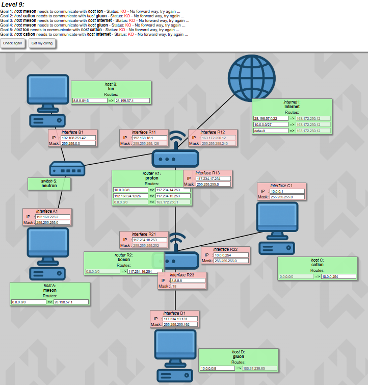

This project has been created as part of the 42 curriculum by gamorcil.

# NetPractice

## Description
NetPractice is a general practical exercise designed to introduce the fundamental concepts of networking. The goal of this project is to configure small-scale networks to ensure communication between devices. By working through various levels, the project covers the logic of addressing, routing, and the structure of the internet.

### Example
#### This is an example of how levels look like without getting solved

## Instructions

### Running the Interface
To access the training interface, open the `index.html` file (provided with the subject resources) in a modern web browser(Chromium based). This interface allows you to interact with the network topology and apply configurations.

### Exporting Configurations
Once you have successfully configured a level and established the required connectivity, use the "Export" button within the interface to save your solution.

### Submission
For the project submission, you must include the 10 exported configuration files at the root of your repository. Ensure they are named correctly corresponding to each level:
- `level1.json`
- `level2.json`
- ...
- `level10.json`

## Resources

### Networking Concepts
This project relies on a solid understanding of the following networking concepts:

#### TCP/IP Addressing
TCP/IP (Transmission Control Protocol/Internet Protocol) is the foundational suite of protocols for the internet. In this project, we focus on **IPv4**, where devices are assigned unique 32-bit addresses (e.g., `192.168.1.1`). Understanding how these addresses are structured and how CIDR (Classless Inter-Domain Routing) notation (e.g., `/24`) works is crucial for configuring networks correctly.

#### Subnet Mask
A subnet mask is used to divide an IP address into two parts: the **network address** and the **host address**. It determines the size of the network. For example, a subnet mask of `255.255.255.0` (or `/24`) means the first three octets identify the network, while the last octet identifies the specific device. This concept is key to solving levels where networks must be split into smaller subnets.

#### Default Gateway
The default gateway is the device (usually a router) that a host uses to communicate with devices on **other networks**. If a computer wants to send a packet to an IP address that is not in its own subnet, it sends it to the default gateway. Without a correctly configured gateway, a device is isolated to its local LAN.

#### Routers vs. Switches
- **Switches** operate at **Layer 2 (Data Link Layer)**. They connect devices within the *same* network using MAC addresses. They are used to expand the number of ports available in a LAN.
- **Routers** operate at **Layer 3 (Network Layer)**. They connect *different* networks together. They use IP addresses to make forwarding decisions and are responsible for passing data between subnets.

#### OSI Layers
The OSI model conceptualizes how network systems communicate. This project primarily involves:
- **Layer 2 (Data Link):** Dealing with physical addressing (MAC addresses) and switching.
- **Layer 3 (Network):** Dealing with logical addressing (IP addresses) and routing.

### References
- **Network Chuck - You suck at subnetting:** [Playlist Link](https://www.youtube.com/watch?v=5WfiTHiU4x8&list=PLIhvC56v63IKrRHh3gvZZBAGvsvOhwrRF)
  - This playlist was used extensively to understand the concept of subnetting. It provided a clear, step-by-step method for calculating network addresses, broadcast addresses, and valid host ranges, which was essential for solving the levels requiring sub-network division.
  - I cannot recommend this playlist enough; these videos made the project so fun, way easier, and more accessible. It also helped me discover Chuck's channel, where he has a lot of videos on interesting topics. Right now, I'm learning about installing Home Assistant on a Raspberry Pi thanks to him.

### AI Usage
AI tools were used in this project for the following tasks:
- **Documentation:** Generating the structure and content of this `README.md` file to meet the subject requirements.
- **Concept Clarification:** summarizing complex networking definitions to aid in understanding the theoretical background before applying it to the exercises.
